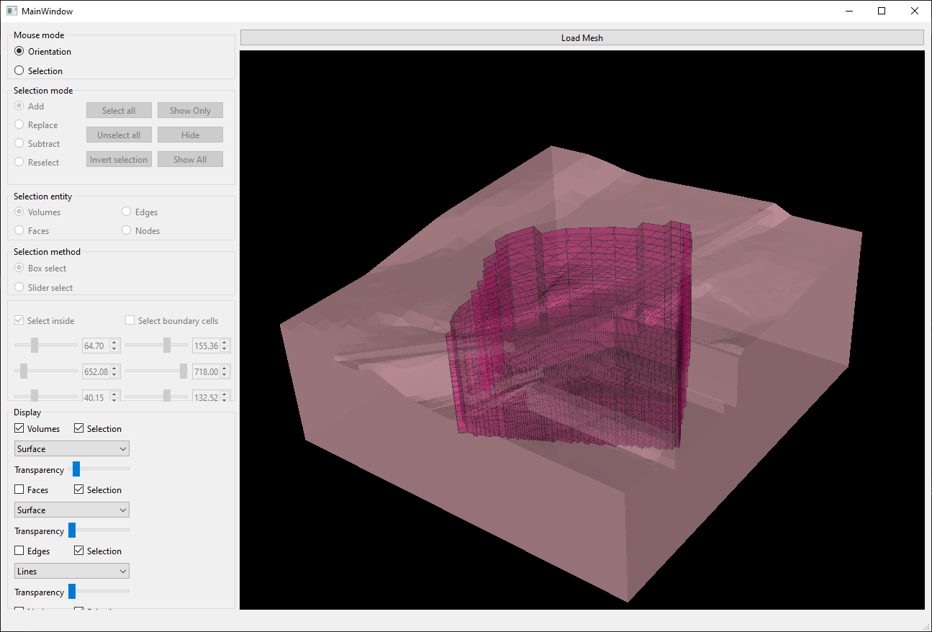

# Prepro
A vtk-based Finite Element Pre-Processor

The general idea is to build a tool to create a finite element model starting from a 3D volume unstructured grid. The tool allows creation of element, face, edge and node lists that can be used to create input data for various FE-codes.

